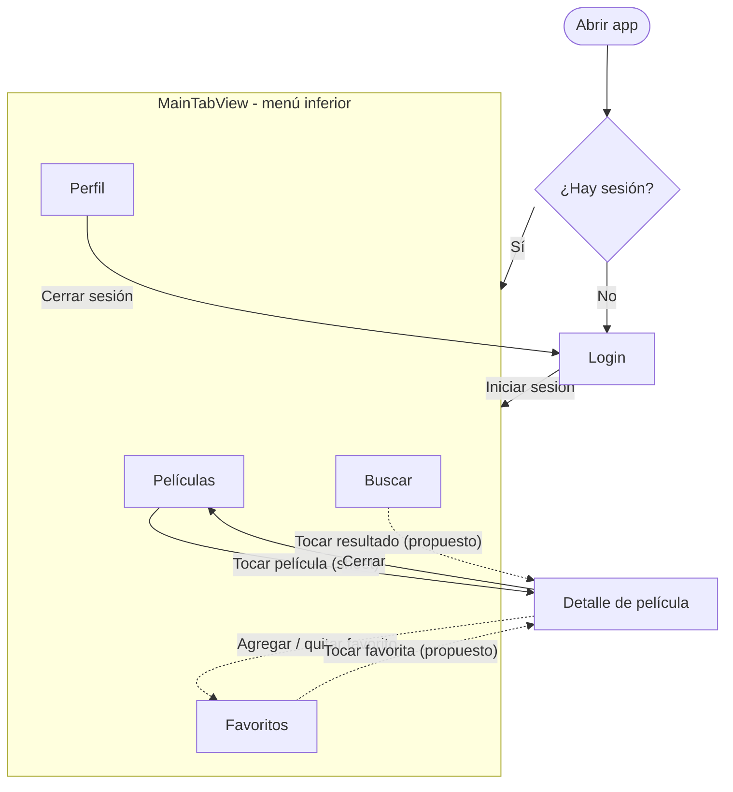

# Navegación y estado — CuevanaX

Documento de planeación del MVP. Describe qué pantallas tiene la app, cómo se relacionan, qué información maneja cada una, dónde debe vivir cada dato y cómo se mueve el usuario entre pantallas con SwiftUI. No es una especificación de código nuevo: parte de lo que ya existe en el proyecto (`Cuevana/*.swift`) y justifica hacia dónde conviene llevarlo.

## 1. Mapa de navegación

### Pantallas del MVP

| # | Pantalla | Archivo | Tipo de presentación |
|---|----------|---------|----------------------|
| 1 | Login | `LoginView.swift` | Raíz de la app (sin sesión) |
| 2 | Contenedor con menú inferior | `MainTabView.swift` | Raíz de la app (con sesión) |
| 3 | Películas | `PeliculasView.swift` | Pestaña 1 |
| 4 | Buscar | `BuscarView.swift` | Pestaña 2 |
| 5 | Favoritos | `FavoritosView.swift` | Pestaña 3 |
| 6 | Perfil | `PerfilView.swift` | Pestaña 4 |
| 7 | Detalle de película | `DetallePeliculaView.swift` | Hoja modal (`sheet`) desde Películas |

### Diagrama

Las flechas continuas ya existen en el código. Las punteadas con "(propuesto)" son decisiones de diseño para la siguiente etapa: hoy Buscar y Favoritos solo muestran el título y no abren el detalle.

### Relaciones clave

- Hay exactamente dos "mundos": sin sesión (Login) y con sesión (las cuatro pestañas). Se cambia de uno a otro solo con autenticarse o cerrar sesión.
- Las cuatro pestañas son pares entre sí: el usuario puede saltar de una a otra en cualquier momento sin perder dónde estaba.
- El Detalle es una pantalla subordinada: siempre se llega a ella desde una lista de películas y se regresa al mismo punto.
- Favoritos es la única pantalla que depende de un cambio hecho en otra (el Detalle).

## 2. Información por pantalla

Leyenda: **Muestra** = lo que se ve; **Recibe** = lo que le llega de fuera; **Modifica** = lo que puede cambiar; **Conserva** = lo que debe sobrevivir al cerrar la pantalla o la app.

### Login

| | |
|---|---|
| Muestra | Logo, título "CuevanaX", campos de correo y contraseña, botón "Iniciar Sesión" |
| Recibe | Binding a `estaAutenticado` |
| Modifica | Correo y contraseña (mientras se escriben); `estaAutenticado = true` al entrar |
| Conserva | Nada de lo escrito: la contraseña nunca debe guardarse. Solo se conserva el resultado (sesión iniciada) |

### Películas

| | |
|---|---|
| Muestra | Lista de películas en cartelera con póster, título y calificación |
| Recibe | Lista de películas (hoy `peliculasEjemplo`; después, TMDB) |
| Modifica | Qué película está seleccionada (para abrir el detalle) |
| Conserva | La lista no se guarda como dato propio de la pantalla; viene de la fuente de datos |

### Buscar

| | |
|---|---|
| Muestra | Campo de búsqueda; estado vacío ("Busca una película") o lista de resultados |
| Recibe | El catálogo de películas contra el cual filtrar |
| Modifica | El texto de búsqueda |
| Conserva | Nada: el texto es temporal. Es aceptable que se borre al cerrar la app |

### Favoritos

| | |
|---|---|
| Muestra | Lista de películas marcadas como favoritas o estado vacío ("No tienes películas favoritas") |
| Recibe | El conjunto de favoritas |
| Modifica | Nada en el MVP actual (los favoritos se quitan desde el Detalle); se puede añadir la opción de quitar desde aquí deslizando la fila |
| Conserva | Los favoritos sí deben persistir entre sesiones (ver sección 3) |

### Perfil

| | |
|---|---|
| Muestra | Nombre y correo del usuario, botón "Cerrar Sesión" |
| Recibe | Datos del usuario autenticado (hoy texto fijo "Usuario" / "usuario@ejemplo.com") y binding a `estaAutenticado` |
| Modifica | `estaAutenticado = false` al cerrar sesión |
| Conserva | Nombre y correo del usuario mientras haya sesión |

### Detalle de película

| | |
|---|---|
| Muestra | Póster, título, año y género, sinopsis, botón de favorito y botón "Cerrar" |
| Recibe | La película seleccionada (`Pelicula`) |
| Modifica | Si la película es favorita o no |
| Conserva | La marca de favorita (se escribe en la fuente de datos, no se queda en la pantalla) |

## 3. Organización del estado

### Principio

Cada dato vive en el nivel más bajo del árbol de vistas que todavía alcance a todas las vistas que lo necesitan. Lo que solo usa una pantalla es estado local; lo que usan varias sube al ancestro común o a un objeto compartido; lo que debe sobrevivir a la app se persiste.

### Tabla de decisiones

| Dato | Quién lo usa | Dónde debe vivir | Mecanismo SwiftUI | Justificación |
|------|--------------|------------------|-------------------|---------------|
| Sesión iniciada (`estaAutenticado`) | `CuevanaApp`, Login, Perfil | En `CuevanaApp` (la raíz) | `@State` en la raíz, pasado con `@Binding` | Decide qué árbol de vistas se muestra, así que solo la raíz puede controlarlo. Login y Perfil lo modifican, por eso reciben un binding |
| Correo y contraseña escritos | Solo Login | En Login | `@State` privado | Ninguna otra pantalla los necesita; la contraseña no debe salir ni guardarse |
| Texto de búsqueda | Solo Buscar | En Buscar | `@State` privado | Es efímero y local |
| Película seleccionada para el sheet | Solo Películas | En Películas | `@State` (`sheet(item:)`) | Solo controla la presentación del detalle |
| Catálogo de películas | Películas, Buscar, Detalle | En un objeto compartido de datos, fuera de las vistas | Clase `@Observable` (o `ObservableObject`) inyectada con `.environment` | Hoy es la variable global `peliculasEjemplo`. Funciona, pero SwiftUI no se entera de los cambios y no se puede probar ni reemplazar por TMDB. Un objeto observable da una sola fuente de verdad |
| Favoritos | Detalle (escribe), Favoritos (lee), Películas (puede mostrar corazón) | En el mismo objeto compartido, persistido | Objeto `@Observable` + persistencia en `UserDefaults` | Hoy el Detalle tiene su propio `@State esFavorita` y además modifica el array global; son dos copias que pueden desincronizarse. Debe haber una sola |
| Datos del usuario (nombre, correo) | Perfil | Con la sesión, en el objeto de autenticación | Objeto `@Observable` de sesión | Hoy son textos fijos; al autenticarse de verdad vendrán del usuario |
| Modelo de SwiftData `Item` | Nadie | Eliminar | — | Es código de plantilla de Xcode (solo guarda un `timestamp`) y no tiene relación con el producto |

### Por qué no `@State` en todo

`@State` pertenece a una vista concreta y se pierde si la vista se destruye. Es correcto para texto de búsqueda o campos del formulario, pero incorrecto para favoritos: el Detalle se crea y se destruye cada vez que se abre, y Favoritos está en otra pestaña.

### Por qué `UserDefaults` para favoritos

El alcance del proyecto dice "guardado de favoritos de forma local". Basta con guardar una lista de identificadores de película (no la película completa), que es pequeña y simple. SwiftData sería válido pero es más pesado de lo que este MVP necesita.

### Problemas del código actual que este diseño corrige

1. `peliculasEjemplo` es una variable global mutable: ninguna vista se redibuja de forma confiable cuando cambia.
2. `Pelicula.id` es `UUID()` generado en cada creación. Si el catálogo viene de TMDB, el id debe ser el id de TMDB; con UUID aleatorio los favoritos no se pueden guardar ni reencontrar entre ejecuciones.
3. `esFavorita` vive dentro de `Pelicula` y también en `@State` del Detalle: dos fuentes de verdad.
4. El botón de login pone `estaAutenticado = true` sin validar nada.

## 4. Estrategia de navegación

### Navegación de primer nivel: `TabView`

Las cuatro secciones (Películas, Buscar, Favoritos, Perfil) son destinos de igual jerarquía a los que el usuario regresa constantemente. `TabView` es el mecanismo estándar de iOS para eso y conserva el estado de cada pestaña al cambiar entre ellas.

### Cambio entre Login y app: renderizado condicional en la raíz

`CuevanaApp` muestra `LoginView` o `MainTabView` según `estaAutenticado`. Al cerrar sesión, el árbol completo de pestañas desaparece y no queda nada del usuario anterior en pantalla. No se usa `NavigationStack` para esto porque iniciar y cerrar sesión no es "avanzar y regresar": es cambiar de contexto.

### Detalle de película: `sheet(item:)` hoy, `NavigationStack` como mejora

- **Hoy:** el Detalle se presenta como hoja modal con `sheet(item: $peliculaSeleccionada)`. Es correcto para consultar algo y cerrarlo, y el botón "Cerrar" usa `@Environment(\.dismiss)`.
- **Propuesta:** envolver cada pestaña de lista en un `NavigationStack` con `NavigationLink(value:)` y `.navigationDestination(for: Pelicula.self)`. Razones: (a) da botón "atrás" y gesto de deslizar gratis, (b) permite abrir el mismo Detalle desde Películas, Buscar y Favoritos sin duplicar código, (c) cada pestaña mantiene su propia pila. Se conserva el `sheet` solo si el equipo decide que el detalle es una acción temporal.

### Cómo viaja la información entre pantallas

| Situación | Mecanismo |
|-----------|-----------|
| Padre le pasa un dato de solo lectura a un hijo | Parámetro normal (`let pelicula: Pelicula`) |
| Padre e hijo deben modificar el mismo valor | `@Binding` (p. ej. `estaAutenticado`) |
| Muchas pantallas lejanas comparten datos | Objeto `@Observable` inyectado con `.environment(...)` desde la raíz |
| Cerrar una pantalla presentada | `@Environment(\.dismiss)` |
| Elegir qué mostrar según un estado | `if` / `else` en la vista raíz |

### Flujo completo del usuario

1. Abre la app → ve Login.
2. Inicia sesión → `estaAutenticado = true` → aparece el `TabView` en la pestaña Películas.
3. Toca una película → se abre el Detalle.
4. Marca favorita → el objeto compartido actualiza el favorito → Favoritos lo muestra sin recargar.
5. Cambia a Buscar, escribe → ve resultados filtrados al instante.
6. Va a Perfil → "Cerrar Sesión" → `estaAutenticado = false` → regresa a Login.

## 5. Decisiones pendientes

- Si el Detalle se queda como `sheet` o pasa a `NavigationStack`.
- Si el login valida contra algo real o queda como simulación para el MVP (el alcance excluye el registro de usuarios).
- Si la sesión debe recordarse al cerrar la app (por ejemplo, con `@AppStorage`) o pedir login cada vez.
